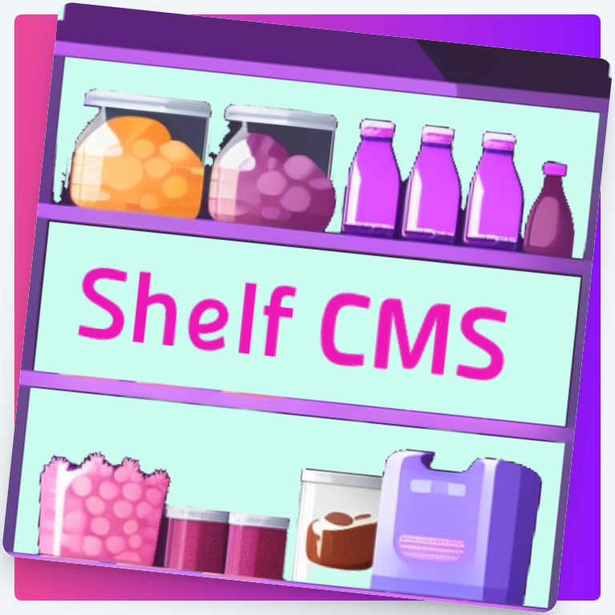

# Shelf Slim Backend

<div style='display: flex; justify-content: center; margin: 20px'>
  
</div>

> 🥳 [SHELF](https://shelf-cms.io) turns your **Firebase** project into a **HEADLESS** CMS

# What is this ?
This repository is a complementary simple backend for achieving extra capabilities with `SHELF` under **170kb**:
- Creating Checkouts from Web or Mobile
- Capture / Void / Refund Payments 💳 (Currently PayPal, but more are coming and you can add your own)
- Marketing emails (User signup, Payments)

## I want it, how to use it ?
Clone this repository and follow instructions

# Instructions
### 1. Create Firebase project
Simply, follow our guide [HERE 📖](https://shelf-cms.io/docs/setup/project)

> Write `projectId` and your Auth `uid` (when you created yourself as user)

### 2. Clone this repository
```bash
git clone https://github.com/shelf-cms/shelf-slim-backend.git
```

### 3. Install `firebase CLI` globally
```bash
npm install -g firebase-tools
```

### 4. Kick some things
cd into the repo directory
```bash
firebase login
```

### 5. Edit `.firebaserc`
Open `.firebaserc` and paste your `projectId` into `YOUR_PROJECT_ID_HERE`

### 6. Edit `firestore.rules`
Open `firestore.rules` and paste your `uid` into `YOUR_UID_HERE`

### 7. Edit `storage.rules` (Optional, if you prefere other storage services)
Open `storage.rules` and paste your `uid` into `YOUR_UID_HERE`

### 8. Deploy Firestore rules and indexes and storage rules
```bash
firebase deploy --only firestore,storage
```

### 9. Tinker with `functions` before deploy
```bash
firebase emulators:start --only functions
```

If, you are ready to deploy the functions
```bash
firebase deploy --only functions
```

### 10. Update your backend @ `shelf`
- Login to [SHELF](https://shelf-cms.io)
- **Settings** > Update `Backend URL` with your local or production url.
- 💡 For local dev, make sure your browser does not block requests to localhost (Brave browser does it and it can be disabled)

### 11. Tinker with the backend
💡 Few suggestions:
- Edit `functions/src/actions/send-mail.js` with your own:
  - `STORE_NAME`
  - `STORE_WEBSITE`
  - `YOUR_MAIL`
  - `SEND_GRID_SECRET` (Be sure to open an account with sendgrid)
- Modify the logic of events at `functions/index.js`
- Add a new payment gateway by inspecting `functions/gateways` folder and reading [The SHELF Gateways Docs 📖](https://www.shelf-cms.io/docs/backend/payments)

